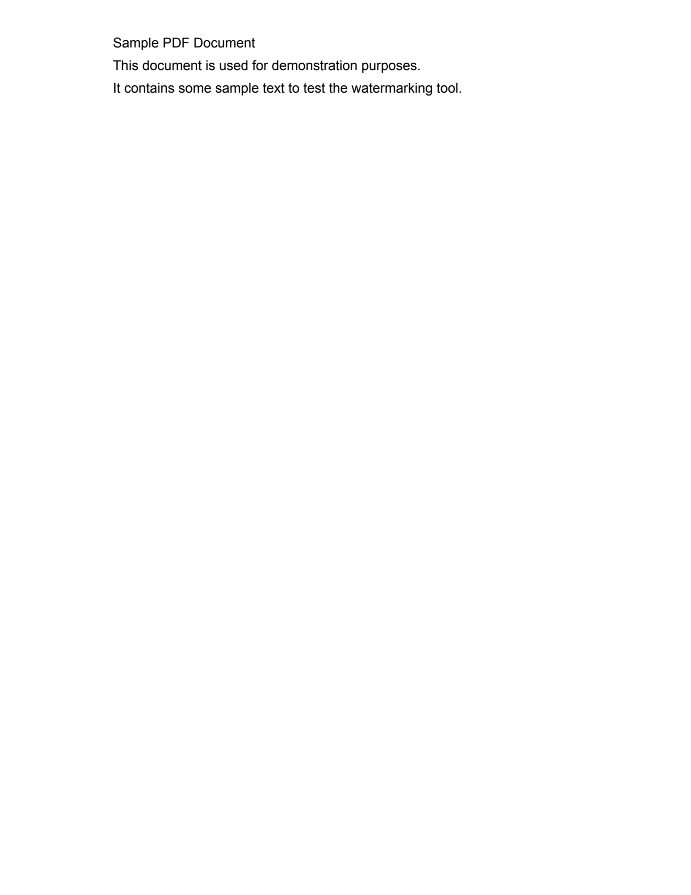
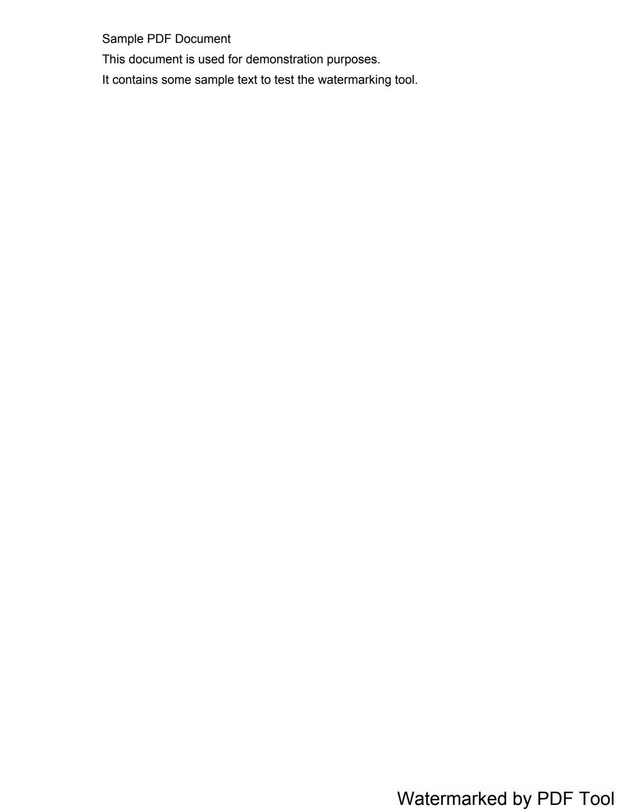

# PDF Watermarker Tool 📄✨

A **premium**, feature‑rich command‑line utility for adding **text watermarks** to PDF files.  It supports clickable URLs, automatic background‑color detection for optimal contrast, and flexible positioning.

---

## ✨ Key Features

- **Clickable URLs** – any `http://` or `https://` links in the watermark become active hyperlinks.
- **Smart contrast** – when `--bg-color auto` is used, the script detects the dominant page colour and selects black or white text for maximum readability.
- **Positioning options** – choose from `topleft`, `bottomleft`, `topright`, or `bottomright` (default).
- **Customizable appearance** – adjust font size and background colour.
- **Zero‑dependency system binaries** – relies on pure Python libraries (`PyPDF2`, `reportlab`, `pypdfium2`, `Pillow`) listed in `requirements.txt`.

---

## 📸 Demo

| Before | After |
| :---: | :---: |
|  |  |

---

## 🚀 Quick Start

### Option A: Using `uv` (Recommended)

If you have [uv](https://github.com/astral-sh/uv) installed, you can run the tool directly without manual setup:

```bash
# Run directly with arguments
uv run pdf_watermarker.py INPUT.pdf OUTPUT.pdf --text "Confidential"
```

### Option B: Standard Python Setup

```bash
# Clone the repository
git clone https://github.com/your‑username/pdf_tool.git
cd pdf_tool

# (Optional) create a virtual environment
python3 -m venv .venv && source .venv/bin/activate

# Install dependencies
pip install -r requirements.txt
```

### Adding a watermark

```bash
python pdf_watermarker.py INPUT.pdf OUTPUT.pdf \
    --text "Visit https://example.com for more info" \
    --position bottomright \
    --font-size 18 \
    --bg-color auto
```

**Parameters**
- `INPUT.pdf` – path to the source PDF.
- `OUTPUT.pdf` – destination file for the watermarked PDF.
- `--text` – watermark text; URLs are auto‑linked.
- `--position` – one of `topleft`, `bottomleft`, `topright`, `bottomright` (default).
- `--font-size` – size of the watermark text (default 18).
- `--bg-color` – background colour of the watermark box. Use `auto` to let the script pick a colour that contrasts with the page.

---

## 📚 Documentation

- **`pdf_watermarker.py`** – the main script that implements the watermarking logic.
- **`debug_paragraph.py`** – helper script for inspecting raw PDF text (useful for debugging OCR pipelines).
- **Adding new utilities** – drop a new `.py` file in the repository root, import the necessary libraries, and expose a `main()` function following the same Click‑based pattern.

---

## 🛠️ Development

1. **Run tests** (if any):
   ```bash
   pytest
   ```
2. **Lint & format**:
   ```bash
   black . && flake8 .
   ```
3. **Contribute** – fork the repo, create a feature branch, and open a Pull Request.

---

## 📦 Release & Distribution

When you’re ready to publish a new version:

```bash
# Bump version in `setup.py` (or pyproject.toml)
python -m build
twine upload dist/*
```

---

## 🙏 Acknowledgements

Built with ❤️ by the open‑source community. Special thanks to the maintainers of **PyPDF2**, **ReportLab**, **pypdfium2**, and **Pillow** for making PDF manipulation painless.

---

*Enjoy adding elegant watermarks to your PDFs!*
